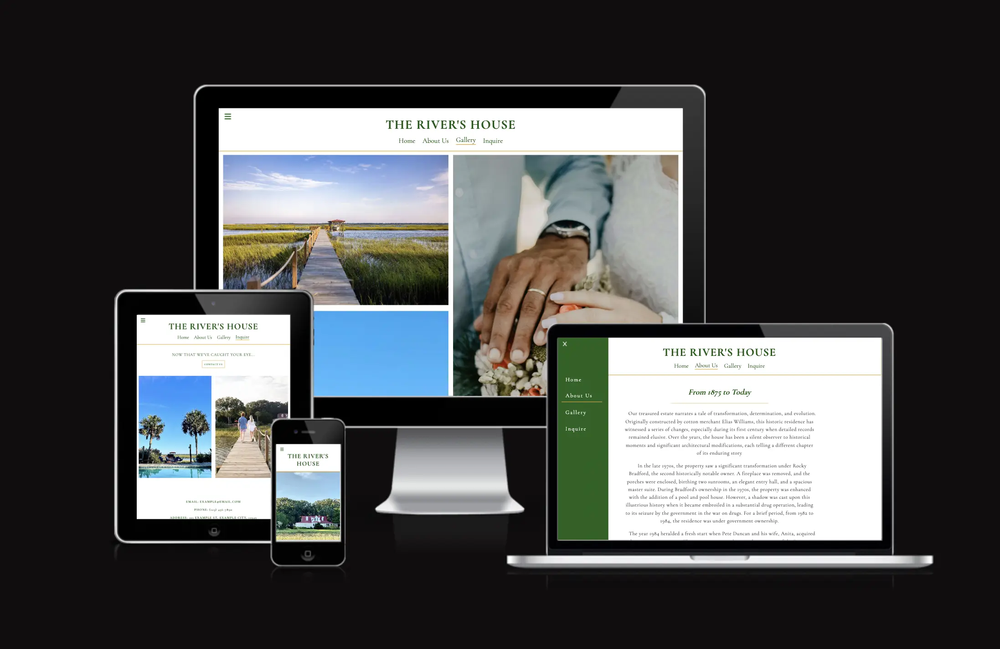
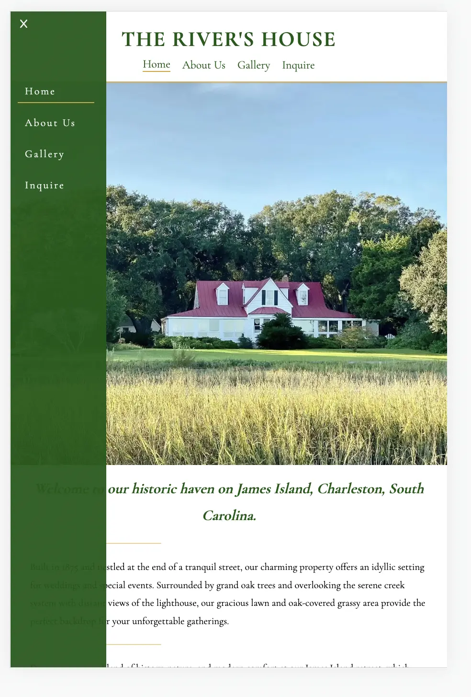
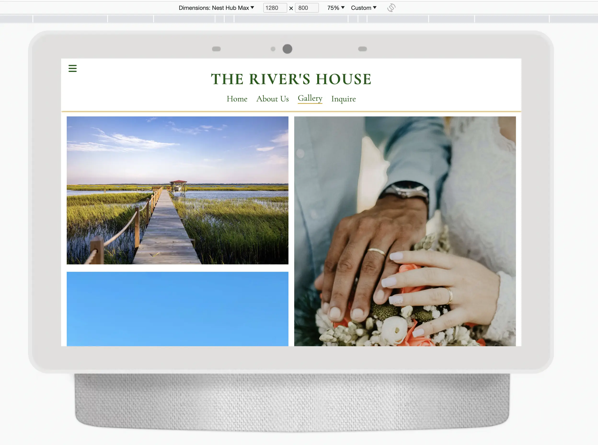
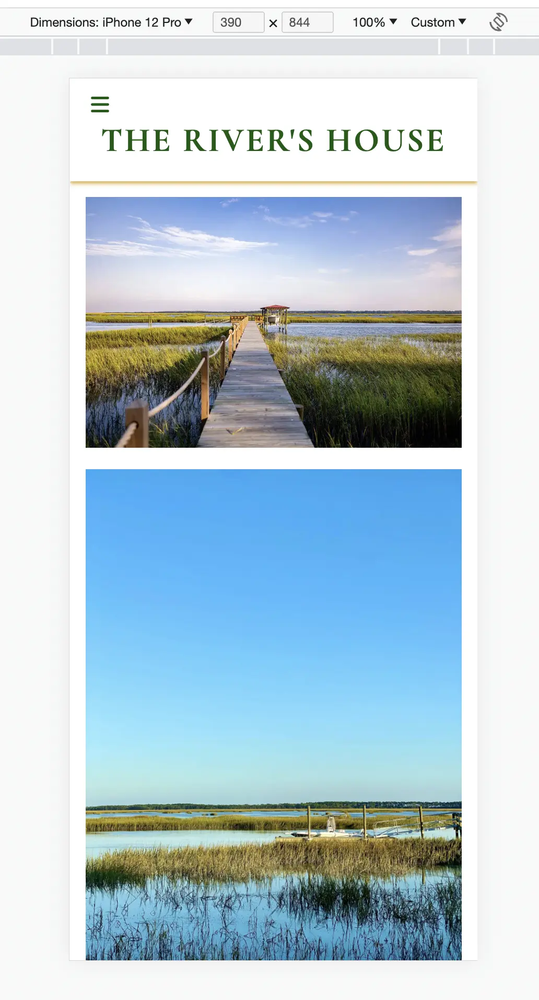

# The River's House

## Overview

The River’s House website is a digital platform designed to showcase a venue suitable for private events, parties, and weddings. It provides users with images and details about the venue's features and history. The goal is to give potential customers a clear understanding of what the venue offers and how it can serve their event needs. The website is user-friendly, ensuring easy navigation for all visitors.

## Features

### Navigation Bar

- **Usability**: Featured across all pages, this fully responsive navigation bar ensures users can easily transition between the Logo, Home page, About Us, Gallery, and Inquiry page without needing the browser's back button.
- **Design**: There are two types of navigation. The horizontal menu beneath the logo becomes visible on screens wider than 768px. The toggle sidebar nav, activated by the burger icon, is always accessible, catering to users who might have scrolled down and wish to navigate elsewhere.

### Landing Page

- **Introduction**: This section features photographic slideshow with a text overlay, offering users an immediate visual understanding of the venue's identity and ambiance.

### About Us
- **Engagement**: This section delves into the rich history of the venue, its architectural evolution, and its current significance, tapping into the innate human curiosity about past stories and heritage.

### Gallery Section

- **Visual Showcase**: A dynamic gallery adapts to different screen sizes, displaying photos of the house, its surroundings, and some stock images (to depict potential events since the venue has yet to host them).
- **Updates**: The gallery is primed for future enhancements, both in terms of content (new photos) and functionality (advanced coding techniques to allow for a more sophisticated slideshow with thumbnail photos).

### Footer

- **Connectivity**: Direct links to potential social media platforms promise deeper engagement. Although the venue is still establishing its social media presence, placeholders are used, including a Pinterest link which can resonate with those planning weddings searching for inspiration. 

### Inquire

- **Engagement**: Scenic photos draw users' attention. A "contact us" button is linked to a comprehensive contact form at the bottom.
- **Responsiveness**: This screen adapts to multiple screen sizes, with the photos changing maneuvering around the screen for optimal viewer experience. 
- **Location**:Embedded into the site is a small snippet of the map to give the viewer
- **Functionality**: The form captures vital details such as the event type, guest count, preferred dates, and more. All fields are mandatory, ensuring detailed queries.

## Planned Features

- **Media**: Future plans include replacing stock images with venue-specific photos. There's anticipation for a wedding in April and potential drone footage capturing the venue from unique angles.
- **Navigation**: Enhancement of the sidebar navigation across all browsers is on the cards.
- **Branding**: The header is due for a stylistic revamp. Moreover, a professionally designed logo is in the pipeline, a collaboration with the owner (a licensed Architect and profeccient in deisgn photoshop) is n the works.
- **Content Expansion**: The homepage will see richer content, with added features on the list items and information to entice visitors. There's a planned increase in internal linking, ensuring user engagement while maintaining aesthetics.

## Testing

- **Validation**: All pages underwen testing via the HTML and CSS validators. These sessions identified and rectified minor errors like extra quotation marks and improper nesting.
- **Cross-browser Testing**: The site's compatibility was assessed on multiple devices and browsers. During this phase, it was discovered that the side-bar nav conflicted with the slideshow on Safari.
- **Performance**: Lighthouse was employed to evaluate each page, revealing performance hitches due to images. These were addressed by converting the already compressed jpg format images to the webp format.
- **Layout Issues**: Challenges like the sticky footer and centering the header logo were resolved with slack community and tutor support.

### Validator Testing

- **HTML**: Most errors detected were simple, including misplaced/duplicate quotation marks and improper element nesting.
- **CSS**: A single parse error was found and corrected.

### Unfixed Bugs

A persistent bug relates to the close icon of the sidebar navigation. Despite setting the display property's value to "none", the icon remains visible. Using `!important` has temporarily resolved this, but the underlying issue remains unidentified.

## Deployment

The platform is hosted on GitHub pages, with deployment as follows:

1. Accessed the GitHub repository and proceeded to the Settings tab.
2. Within the Source section, selected the Master Branch.
3. A successful deployment was indicated by an automatic page refresh and a confirmation ribbon.

## Credits

**Community Help**: Benefitted immensely from the Slack community on challenges related to header centering and footer positioning.

**Tutorials & References**:

- Slideshow tutorials from [YouTube Video 1](https://www.youtube.com/watch?v=j18CH0Grhbw) & [YouTube Video 2](https://www.youtube.com/watch?v=pMltE4J4UQM)
- Varied guidance from [W3Schools](https://www.w3schools.com/)

## Content & Media

- **Text**: The Home and About Us narrative is courtesy of Michael Millon (long-time friend and owner of venue).
- **Icons**: Sourced from Font Awesome.
- **Images**: A blend of personal captures, contributions from Michael Millon, and stock images from [Pexels](https://www.pexels.com/).
=======
The River’s House website is a digital platform designed to showcase a venue suitable for private events, parties, and weddings. It provides users with images and details about the venue's features and history. The goal is to give potential customers a clear understanding of what the venue offers and how it can serve their event needs. The website is user-friendly, ensuring easy navigation for all visitors.

## Features

### Navigation Bar
- **Usability**: Featured across all pages, this fully responsive navigation bar ensures users can easily transition between the Logo, Home page, About Us, Gallery, and Inquiry page without needing the browser's back button.
- **Design**: There are two types of navigation. The horizontal menu beneath the logo becomes visible on screens wider than 768px. The toggle sidebar nav, activated by the burger icon, is always accessible, catering to users who might have scrolled down and wish to navigate elsewhere.

### Landing Page
- **Introduction**: This section features  photographic slideshow with a text overlay, offering users an immediate visual understanding of the venue's identity and ambiance.

### About Us
- **Engagement**: This section delves into the rich history of the venue, its architectural evolution, and its current significance, tapping into the innate human curiosity about past stories and heritage.

### Gallery Section
- **Visual Showcase**: A dynamic gallery adapts to different screen sizes, displaying photos of the house, its surroundings, and some stock images (to depict potential events since the venue has yet to host them).
- **Updates**: The gallery is primed for future enhancements, both in terms of content (new photos) and functionality (advanced coding techniques to allow for a more sophisticated slideshow with thumbnail photos).

### Footer
- **Connectivity**: Direct links to potential social media platforms promise deeper engagement. Although the venue is still establishing its social media presence, placeholders are used, including a Pinterest link which can resonate with those planning weddings.

### Inquire
- **Engagement**: Scenic photos draw users' attention. A "contact us" button is linked to a comprehensive contact form at the bottom.
- **Functionality**: The form captures vital details such as the event type, guest count, preferred dates, and more. All fields are mandatory, ensuring detailed queries.

## Planned Features
- **Media**: Future plans include replacing stock images with venue-specific photos. There's anticipation for a wedding in April and potential drone footage capturing the venue from unique angles.
- **Navigation**: Enhancement of the sidebar navigation across all browsers is on the cards.
- **Branding**: The header is due for a stylistic revamp. Moreover, a professionally designed logo is in the pipeline, a collaboration with the owner (a licensed Architect and profeccient in deisgn photoshop) is n the works.
- **Content Expansion**: The homepage will see richer content, with added features on the list items and information to entice visitors. There's a planned increase in internal linking, ensuring user engagement while maintaining aesthetics.

## Testing
- **Validation**: All pages underwen testing via the HTML and CSS validators. These sessions identified and rectified minor errors like extra quotation marks and improper nesting.
- **Cross-browser Testing**: The site's compatibility was assessed on multiple devices and browsers. During this phase, it was discovered that the side-bar nav conflicted with the slideshow on Safari.
- **Performance**: Lighthouse was employed to evaluate each page, revealing performance hitches due to images. These were addressed by converting the already compressed jpg format images to the webp format.
- **Layout Issues**: Challenges like the sticky footer and centering the header logo were resolved with slack community and tutor support.

### Validator Testing
- **HTML**: Most errors detected were simple, including misplaced/duplicate quotation marks and improper element nesting.
- **CSS**: A single parse error was found and corrected.

### Unfixed Bugs
A persistent bug relates to the close icon of the sidebar navigation. Despite setting the display property's value to "none", the icon remains visible. Using `!important` has temporarily resolved this, but the underlying issue remains unidentified.

## Deployment
The platform is hosted on GitHub pages, with deployment as follows:
1. Accessed the GitHub repository and proceeded to the Settings tab.
2. Within the Source section, selected the Master Branch.
3. A successful deployment was indicated by an automatic page refresh and a confirmation ribbon.

## Credits
**Community Help**: Benefitted immensely from the Slack community on challenges related to header centering and footer positioning.

**Tutorials & References**:
- Slideshow tutorials from [YouTube Video 1](https://www.youtube.com/watch?v=j18CH0Grhbw) & [YouTube Video 2](https://www.youtube.com/watch?v=pMltE4J4UQM)
- Varied guidance from [W3Schools](https://www.w3schools.com/)

## Content & Media
- **Text**: The Home and About Us narrative is courtesy of Michael Millon (long-time friend and owner of venue). 
- **Icons**: Sourced from Font Awesome.
- **Images**: A blend of personal captures, contributions from Michael Millon, and stock images from [Pexels](https://www.pexels.com/).

>>>>>>> refs/remotes/origin/main
